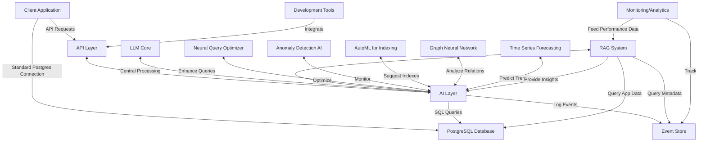

# PsyQL

An extensible, event-driven wrapper over PostgreSQL with integrated AI capabilities for enhanced database design, querying, and maintenance.

## Architecture



## Features

- **Dual Connectivity**: Use as a standard PostgreSQL database or leverage AI-enhanced features through our API.
- **LLM-Powered AI Layer**: Natural language query understanding, intelligent schema recommendations, and more.
- **RAG System**: Enhances AI capabilities with context from both application data and metadata.
- **Neural Query Optimizer**: Deep learning-based query optimization that goes beyond traditional rule-based optimizers.
- **Anomaly Detection**: Real-time monitoring for security issues, data inconsistencies, and performance problems.
- **AutoML for Indexing**: Automated index recommendations and testing for optimal performance.
- **Graph Neural Network**: Analyzes data relationships to enhance schema design and query optimization.
- **Time Series Forecasting**: Predicts future trends in data and query patterns for proactive optimization.
- **Comprehensive Monitoring**: Analytics feed back into the AI layer for continuous improvement.

## Getting Started

### Prerequisites

- PostgreSQL 13 or higher
- Python 3.8+
- Docker (optional, for containerized deployment)

### Installation

1. Clone the repository:
   ```
   git clone https://github.com/your-username/ai-driven-database.git
   cd ai-driven-database
   ```

2. Install dependencies:
   ```
   pip install -r requirements.txt
   ```

3. Set up your PostgreSQL database and update the configuration in `config.yaml`.

4. Initialize the AI-driven wrapper:
   ```
   python init_ai_wrapper.py
   ```

5. Start the service:
   ```
   python run_server.py
   ```

## Usage

### Standard PostgreSQL Connection

Connect to the database using your preferred PostgreSQL client or ORM as usual.

### AI-Enhanced API

Use our REST API to leverage AI-driven features:

```python
import requests

response = requests.post('http://localhost:8000/api/v1/query', json={
    'natural_language_query': 'Find all high-value customers from the last month'
})

print(response.json())
```

## Development

We welcome contributions! Please see our [Contributing Guide](CONTRIBUTING.md) for more details.

## License

This project is licensed under the MIT License - see the [LICENSE](LICENSE) file for details.

## Acknowledgments

- [PostgreSQL](https://www.postgresql.org/)
- [OpenAI](https://openai.com/) for LLM technology
- All our amazing contributors!

